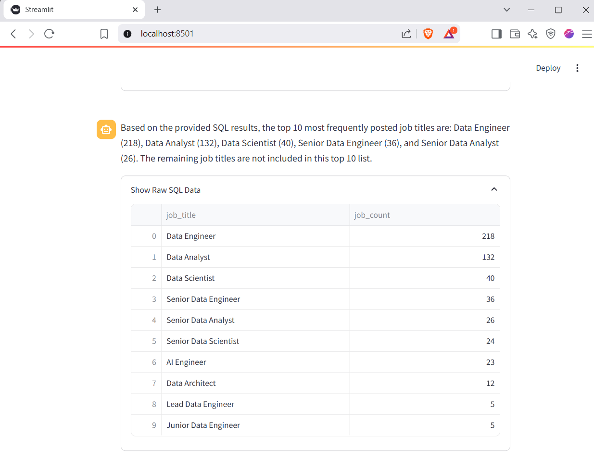
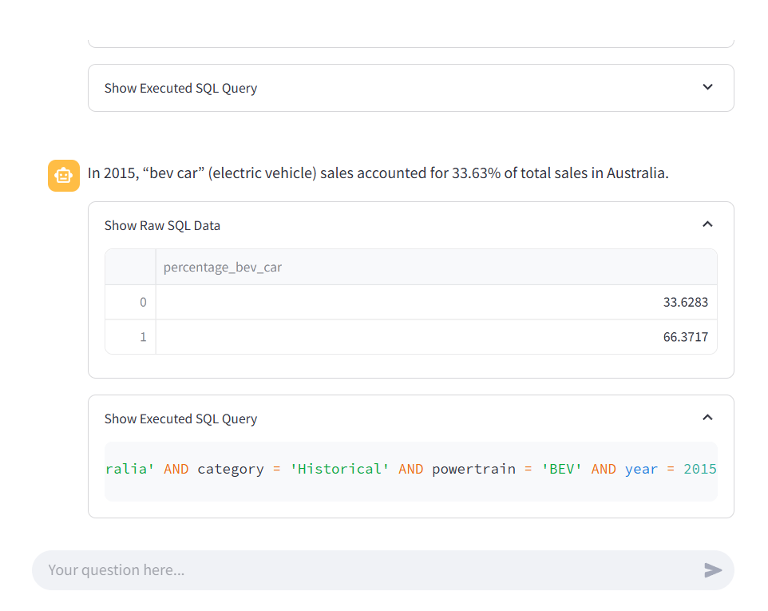
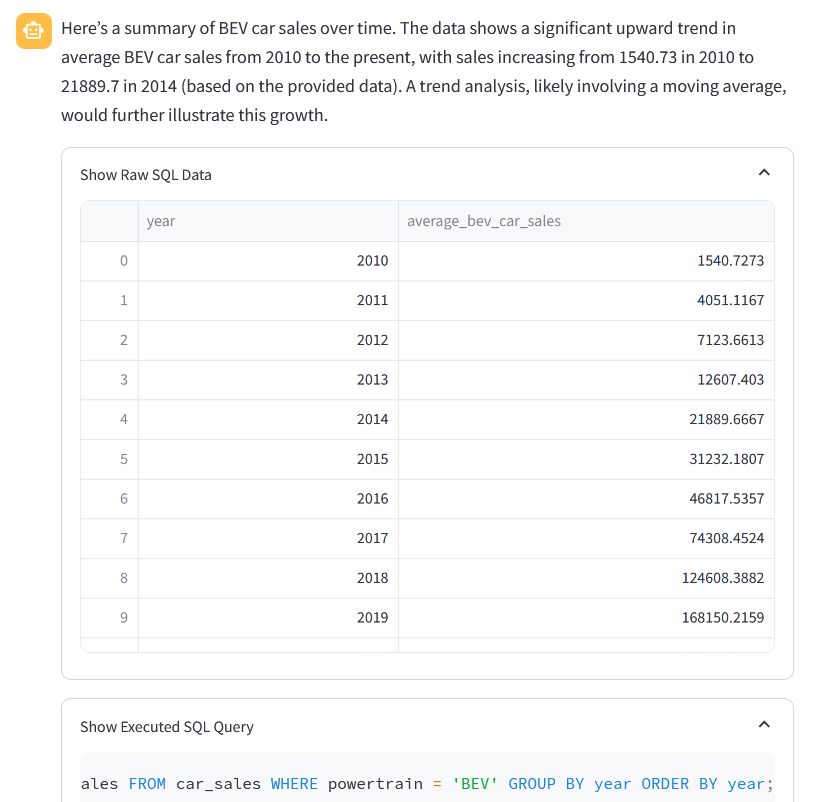

# LocalTabula: Natural Language Tabular Data Assistant

 
[](https://www.gnu.org/licenses/gpl-3.0.en.html)
[](README.md)
[](README.vi.md)


**LocalTabula** is a Streamlit app that transforms your spreadsheets into an interactive chat—right on your machine. Drop in an Excel file or a published Google Sheet CSV, then ask questions in plain English. No cloud services, no data leaks: everything runs locally, powered by SQLite and an in‑memory Qdrant vector store.

---

**Why Go Local in an Era of Super-Smart API LLMs?**

Sure, API-driven powerhouses like ChatGPT or Claude can nail SQL generation, and many cloud tools out-of-the-box boast precision that dwarfs lightweight local models. But if you care about privacy, predictability, customization—and even stretching a small budget—local-first is the only way to guarantee your data stays under your control and your costs stay capped.

1. **Data Sovereignty & Compliance**
   Run everything on-premises so sensitive tables never leave your firewall. No vendor promise can beat zero-network-egress for GDPR, HIPAA, or corporate-policy peace of mind.

2. **Cost Predictability**
   Say goodbye to per-token billing and surprise overages. One up-front investment in modest hardware (even a budget GPU) gives you essentially free inference from then on.

3. **Latency & Reliability**
   Local inference delivers consistent sub-second* responses—no internet required, no service-downtime worries. Perfect for air-gapped or low-bandwidth environments. 

   (*provided you have decent hardware)

4. **Budget-Friendly Hardware**
   Offload a 4-bit–quantized Gemma3-4B to a 4 GB GPU, run the 1.3 B SQL model on CPU, and voilà—powerful LLM inference without a data center.

5. **State-of-the-Art, Unhosted Models**
   As of May 2025, [a compact 3 B-parameter SQL model](https://huggingface.co/mradermacher/XiYanSQL-QwenCoder-3B-2504-GGUF) reportedly outperform API-hosted giants like GPT-4o and Sonnet 3.7 on various benchmarks. If you want to try these SOTA models, local inference is not just an option—it’s often the only way to access their cutting-edge performance.

6. **Full Customization & Extensibility**
   A budget-friendly 1.3 B model can hit ~80 % accuracy on straightforward queries, but drop to ~30 % on nuanced questions without careful prompts. **LocalTabula’s**  multi-stage pipeline—editable templates, few-shot examples, retry loops, and feedback prompts—lets you dial in production-grade results. Control every prompt, swap in the latest open-source weights, tweak retry logic, or layer on RAG/agent workflows. You own the roadmap—no vendor lock-in, no forced upgrades.

---

**In Short:** If you need ironclad privacy, fixed costs, deep customization—and access to the very latest unhosted models—going local isn’t just an alternative; it’s the only way to keep both your data policies and your wallet intact. **LocalTabula** makes it possible—even on humble hardware.


---

## What You Can Do

* **Convert & Index tabular data to SQL database:** Clean column names, build a SQLite database, then select and embed text columns automatically.
* **Natural-Language Queries:** Ask things like “What’s our Q1 revenue by region?” or “Find products like X.”
* **Smart Routing:** The app decides—SQL or semantic search—then packages schema and sample rows for context.
* **Inspect & Tweak:** Expand SQL statements, preview raw rows or embeddings, and re-index on demand.
* **Offline or API:** During development, point to OpenRouter; in production, run purely local GGUF models (with optional GPU acceleration).

## Testing examples

### 🚀 Vietnam Data Jobs (Proprietary Dataset)



**Question:** What are the top 10 job titles?

---

### 🚗 Car Sales Dataset



Source: [Kaggle – Car Sales](https://www.kaggle.com/datasets/jainaru)

**Test:** Simple data retrieval  
**Question:** What is the proportion of BEV car sales in Australia in 2015?

---



**Test:** Trend analysis  
**Question:** What is the trend of BEV car sales over the years?


## Under the Hood: The 5-Stage Query Pipeline

1. **Preflight & Normalization**
   Convert any user question into clear English so local models (or your custom ones) perform at their best. Swap or disable this step via `prompts.yaml`.

2. **Route & Schema Prep**
   Choose SQL or semantic mode based on your question’s structure. Attach the relevant table’s schema and a few sample rows to guide the LLM.

3. **Prompt Refinement (Optional)**
   An LLM polishes your query into a tightly defined SQL prompt. Great for non-experts—skip it if you prefer writing your own query.

4. **Execution & Fallback**

   * **SQL Mode:** Generate, validate, and run SQL against SQLite. On error, loop once for correction.
   * **Semantic Mode:** Embed your question, run a vector search over Qdrant, and return top text snippets.
     If your primary route returns nothing, the other route kicks in as a safety net.

5. **Natural-Language Summary**
   Feed raw results back into an LLM to produce a conversational answer—no more staring at raw tables. Edit the final summary prompt in `prompts.yaml` or disable it to see raw outputs.

---

## Tweak These Knobs

All configurations live in **`.env`**, **`config/prompts.yaml`**, and the helper functions in **`utils.py`**:

| Stage                | File / Function                           | Customize                                              |
| -------------------- | ----------------------------------------- | ------------------------------------------------------ |
| Language Normalizer  | `prompts.yaml`                            | Swap translation logic or disable                      |
| DB Selection         | `select_database_id` / `prompts.yaml`     | Change sample size, prompt template, or fallback logic |
| Refinement & Routing | `refine_and_select` / `prompts.yaml`      | Adjust few-shots, temperature, or force-mode flags     |
| SQL Generation       | `generate_sql_*` / `aux_models`           | Swap NL-SQL models, tweak examples, or retry logic       |
| SQL Execution        | `utils._execute_sql_query`                | Modify DB path, pragmas, or timeouts                   |
| Semantic Search      | `init_qdrant_client` / `aux_models`       | Change embedding model, top-k, or distance metric      |
| Summary              | `generate_final_summary` / `prompts.yaml` | Edit tone, detail level, or skip entirely              |

---
During development, I wrapped the core LLM logic in `LLMWrapper`, letting you switch between a local model or an API-based model (via OpenRouter) by calling `LLMWrapper.mode()` and setting the `OPENROUTER_API_KEY` and `OPENROUTER_MODEL_NAME` environment variables.

## Why Go Dual Models?

Offloading the SQL generator to your CPU while dedicating GPU power to a larger orchestration model unlocks several advantages:

- **Efficient Resource Use:** Compact SQL models (1–3 B parameters) can deliver solid performance on CPU + RAM, leaving your GPU free for a heftier, better reasoning LLM that orchestrates query refinement and translation.

- **Budget-Friendly Hardware:** This split lets you run entirely on a low‑end machine (e.g. 4 GB VRAM GPU + standard CPU) without sacrificing throughput.

- **Language Coverage:** Most SQL-specific models aren’t trained for multilingual input. By pairing them with a stronger “front‑end” model to normalize and translate queries, you get better results across languages.

This dual‑model setup maximizes your hardware, ensures each model handles what it does best, and keeps everything local and cost‑effective.


## Getting Started

1. **Clone & Activate**

   ```bash
   git clone <repo-url> && cd <repo>
   python -m venv venv && source venv/bin/activate
   ```

2. **Install Dependencies**

   ```bash
   pip install -r requirements.txt
   ```

   ⚠️ **GPU Support Requires Advanced Setup**


    You’ll need to build `llama-cpp-python` with the appropriate CMake flags—a nontrivial process. See the README in the **config** folder for some guidance.


3. **Configure**
   Copy `.env.example` to `.env` and set:

   * `DEVELOPMENT_MODE` (true for OpenRouter, false for local GGUF)
   * Paths or repo IDs for your GGUF models
   * API keys (if using OpenRouter)

4. **Run**

   ```bash
   streamlit run app.py
   ```

   Visit `http://localhost:8501` and start chatting with your data!

---


## **Work in Progress**
2025.05.13

1. **UI & Settings Panel**
   The core pipeline is stable, but the interface remains basic. A dedicated settings page for tweaking prompts and parameters (e.g., retry counts, max tokens) is coming soon.

2. **SQL Command Editor**
   We’re adding an interactive SQL console so you can write and run custom queries alongside the automated pipeline.

3. **Google Colab Support**
   There’s an experimental `main.ipynb` for Colab for testing purpose, with ngrok tunneling to expose the Streamlit app. Because Colab currently runs CUDA 12.5, GPU setup can be tricky—if you plan to use Colab, we recommend the 8B llama-3.1 model for smooth performance.
